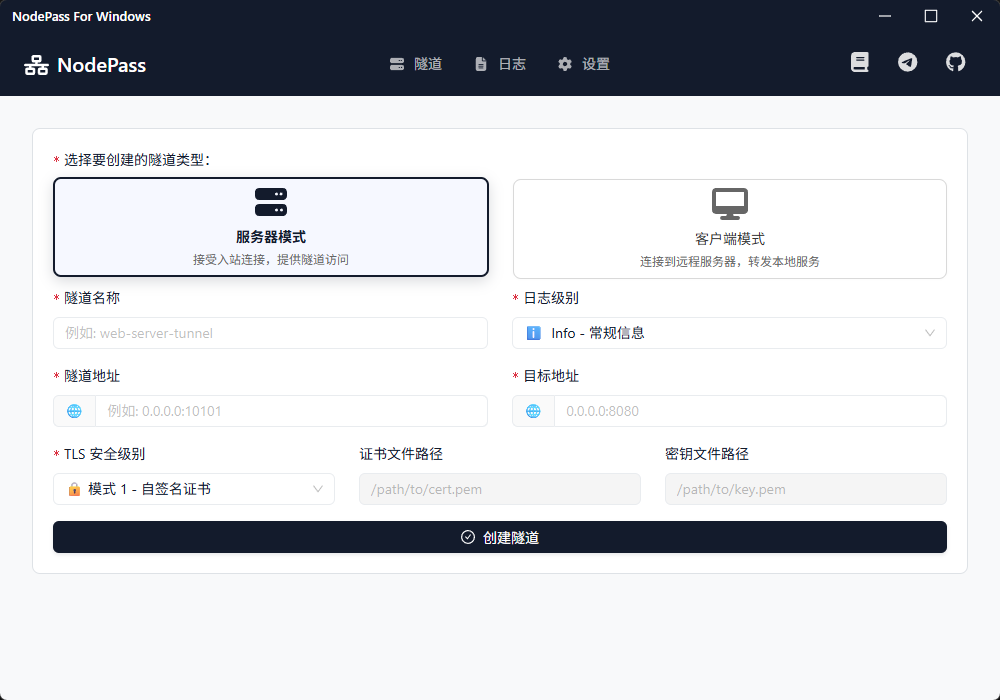
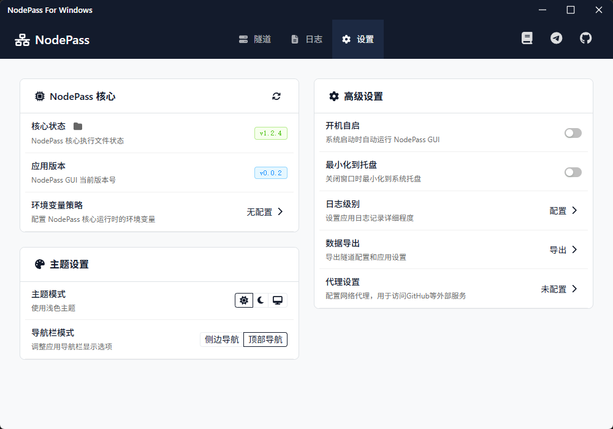
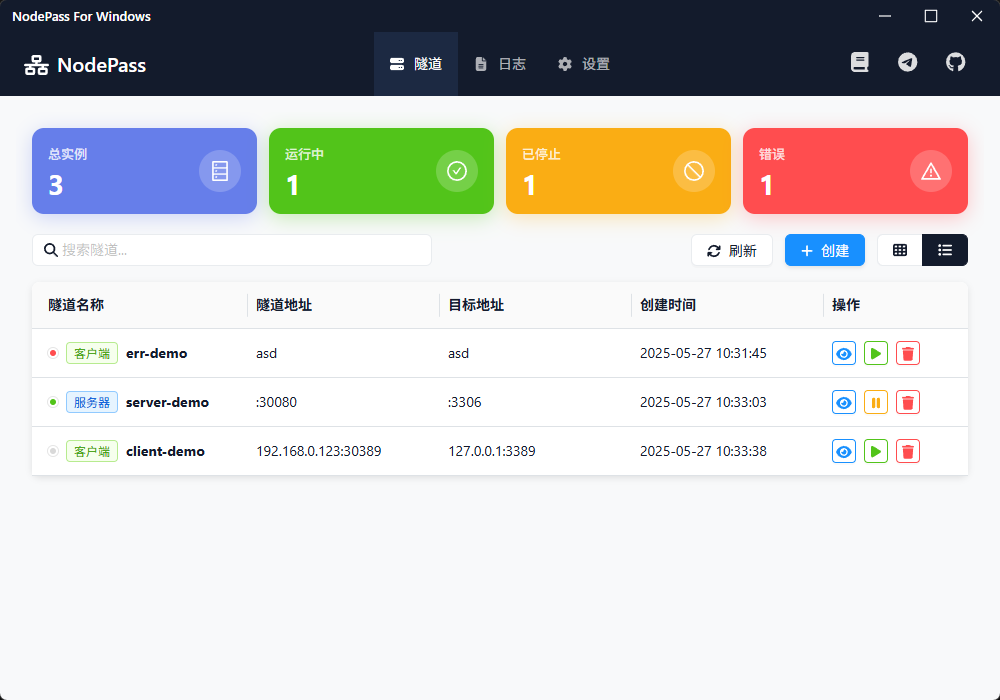
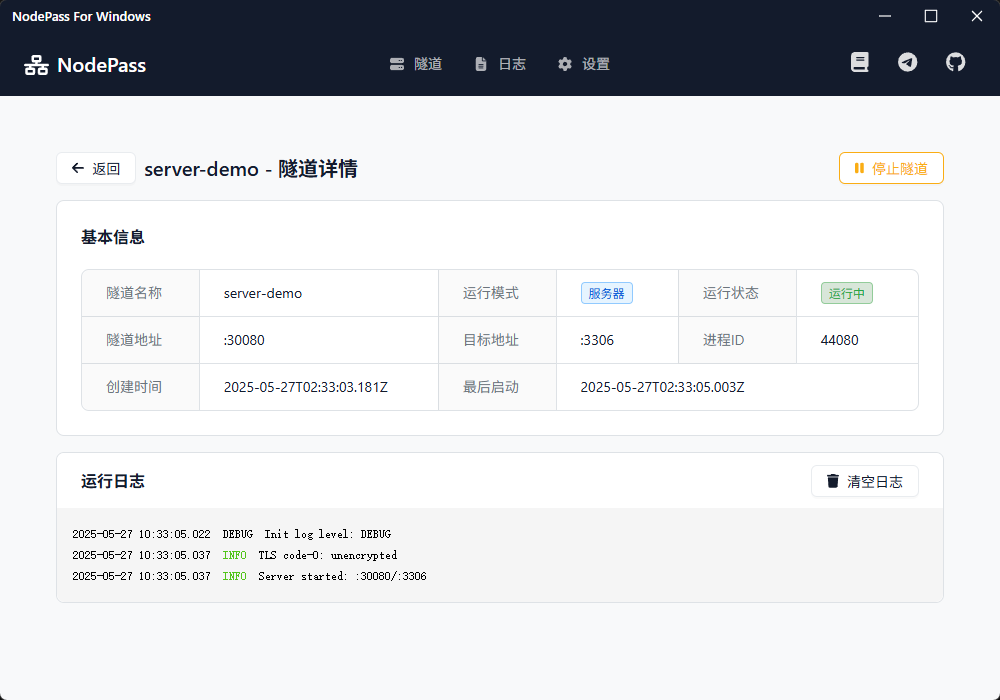
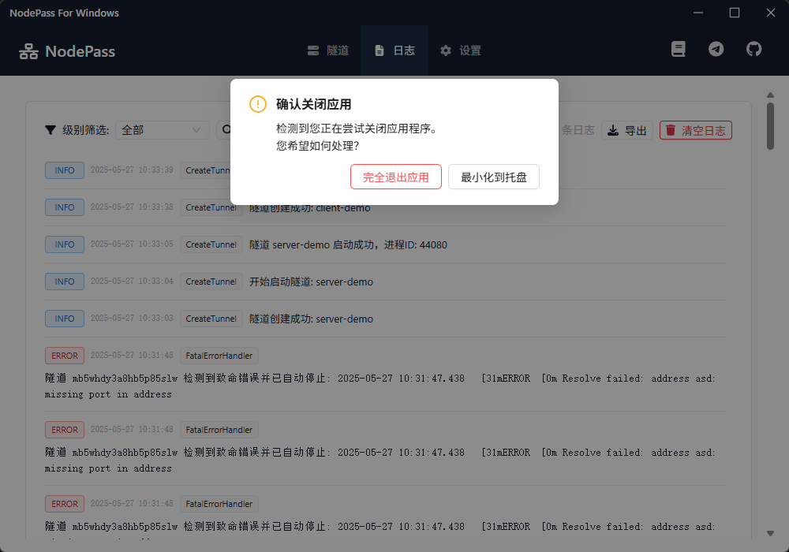

# NodePass GUI

NodePass GUI 是一个基于 Tauri 框架的现代化桌面应用程序，为 [NodePass](https://github.com/yosebyte/nodepass) 提供了图形化的用户界面。NodePass 是一个安全、高效的 TCP/UDP 隧道解决方案，通过预建立的 TLS/TCP 连接提供快速、可靠的跨网络限制访问。

## 📸 界面展示

<div align="center">

| | | |
|:---:|:---:|:---:|
|  |  |  |
|  |  |  |

</div>

## ✨ 功能特点

- 🎨 **现代化界面** - 基于 React + TypeScript + Ant Design 构建的美观易用界面
- ⚙️ **配置管理** - 可视化配置 NodePass 参数，支持保存和加载配置
- 📊 **实时监控** - 实时显示连接状态和日志信息
- 🔧 **双模式支持** - 支持 Server 和 Client 两种运行模式
- 🛡️ **安全选项** - 支持多级 TLS 加密设置
- 💾 **配置持久化** - 自动保存配置到本地，方便复用
- 🚀 **一键启停** - 简单的按钮操作启动和停止隧道连接
- 🔄 **自动更新** - 内置 NodePass 核心，支持自动检查和更新
- 🌙 **深色主题** - 现代化的深色界面设计
- 📱 **响应式布局** - 适配不同窗口大小的界面布局

## 🛠️ 技术栈

### 前端技术
- **框架**: React 18 + TypeScript
- **构建工具**: Vite 6
- **UI 组件库**: Ant Design 5.25
- **图标库**: FontAwesome 6.7 + Ant Design Icons
- **路由**: React Router DOM 7.6
- **终端组件**: XTerm.js 5.3
- **样式**: CSS3 with CSS Variables

### 后端技术
- **框架**: Rust + Tauri 2
- **异步运行时**: Tokio (full features)
- **序列化**: Serde + Serde JSON
- **HTTP 客户端**: Reqwest 0.11
- **文件系统**: Dirs 5
- **压缩解压**: Zip 0.6, Flate2 1.0, Tar 0.4
- **日志**: Log 0.4 + Env Logger 0.11
- **UUID**: UUID 1.0
- **Windows API**: Windows 0.48, WinAPI 0.3

### 开发工具
- **包管理**: pnpm
- **代码检查**: TypeScript 5.6
- **构建系统**: Tauri CLI 2
- **插件**: 
  - tauri-plugin-shell (命令执行)
  - tauri-plugin-notification (通知)
  - tauri-plugin-window-state (窗口状态)

## 🚀 开发指南

### 推荐配置
- **操作系统**: Windows 11
- **内存**: 8GB+ RAM
- **存储**: 4GB+ 可用空间
- **处理器**: 现代多核 CPU

### 环境准备

1. **安装 Node.js 和 pnpm**
   ```bash
   # 安装 Node.js LTS 版本
   # 从 https://nodejs.org/ 下载安装
   
   # 安装 pnpm
   npm install -g pnpm
   ```

2. **安装 Rust 和 Tauri CLI**
   ```bash
   # 安装 Rust
   # 从 https://rustup.rs/ 下载安装
   
   # 安装 Tauri CLI
   cargo install tauri-cli
   ```

### 克隆和运行

1. **克隆仓库**
   ```bash
   git clone https://github.com/your-username/nodepass-gui.git
   cd nodepass-gui
   ```

2. **安装依赖**
   ```bash
   pnpm install
   ```

3. **开发模式**
   ```bash
   pnpm run tauri dev
   ```

4. **构建生产版本**
   ```bash
   pnpm run tauri build
   ```
5. 项目结构
   ```text
   nodepass-gui/
   ├── src/                    # React 前端源码
   │   ├── components/         # React 组件
   │   ├── pages/             # 页面组件
   │   ├── App.tsx            # 主应用组件
   │   ├── App.css            # 全局样式
   │   └── main.tsx           # 入口文件
   ├── src-tauri/             # Tauri 后端源码
   │   ├── src/
   │   │   ├── lib.rs         # 主要业务逻辑
   │   │   └── main.rs        # 入口文件
   │   ├── Cargo.toml         # Rust 依赖配置
   │   ├── tauri.conf.json    # Tauri 配置文件
   │   └── build.rs           # 构建脚本
   ├── public/                # 静态资源
   ├── setup.bat              # 完整安装脚本
   ├── start.bat              # 快速启动脚本
   ├── package.json           # Node.js 依赖配置
   ├── vite.config.ts         # Vite 配置
   ├── tsconfig.json          # TypeScript 配置
   └── INSTALL.md             # 详细安装指南
   ```

### 获取帮助

如果遇到其他问题：

1. 查看 [详细安装指南](INSTALL.md)
2. 检查 [NodePass 仓库](https://github.com/yosebyte/nodepass/issues)
3. 在项目中提交 Issue

## 📂 配置文件

配置文件保存在以下位置：
- Windows: `%APPDATA%\nodepass-gui\configs.json`
- macOS: `~/Library/Application Support/nodepass-gui/configs.json`
- Linux: `~/.config/nodepass-gui/configs.json`


## 📄 许可证

本项目基于 BSD 3-Clause 许可证开源。

## 🤝 贡献

欢迎提交 Issues 和 Pull Requests！

## 🔗 相关链接

- [NodePass 官方仓库](https://github.com/yosebyte/nodepass)
- [NodePass 文档](https://nodepass.eu)
- [Tauri 官方文档](https://tauri.app)
- [React 官方文档](https://react.dev)
- [Ant Design 官方文档](https://ant.design)
